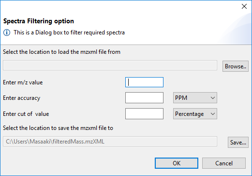

# SpectraFiltering
Java application to filter MS2 scans from a spectra dataset

## Screenshot

## Tutorial
1. Push "Browse.." button to select the location of the input mzXML file
2. Enter m/z value to filter MS2 scans
3. Enter accuracy of the m/z value
4. Select PPM or Dalton for unit of the accuracy
5. Enter cut off intensity value
6. Select Percentage or Absolute for the cut off intensity value
7. Push "Save..." button to select the location of the output mzXML file
8. Push OK to start filtering

After this filtering, only MS2 scans containing a peak with the m/z value, which is close to the specified m/z value within the specified accuracy, will remain in the output mzXML file.
Peaks with smaller intensity values than the specified cut off value will not be considered as the target of this filtering.

## Download
You can download the latest version from our [release page](https://github.com/ReneRanzinger/SpectraFiltering/releases).

<h3>Note</h3>

To run SpectraFiltering you need to have [64 bit Java JRE 1.8](https://www.oracle.com/technetwork/java/javase/downloads/index.html) installed on your computer. 
